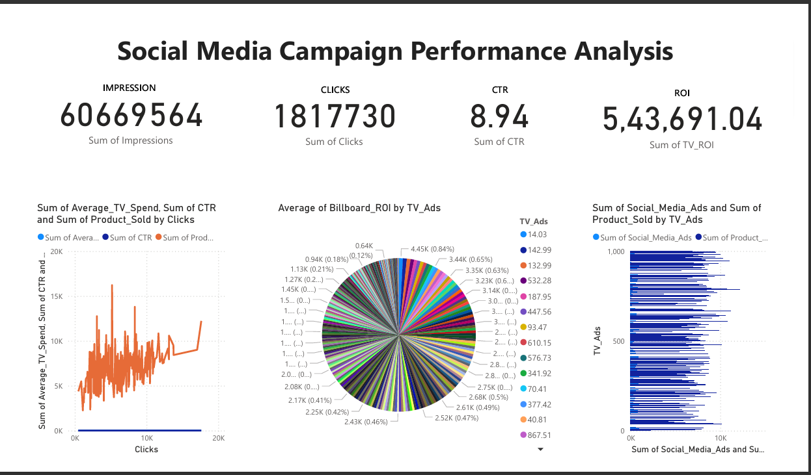

# Task 02 - Social Media Campaign Dashboard

📊 **Social Media Campaign Performance Analysis**  
This project analyzes advertising data and visualizes campaign performance using Power BI.  
It highlights key KPIs such as Impressions, Clicks, CTR, ROI, and provides insights into top-performing ads.  

---

## 📌 Dashboard Preview

---

## 🚀 Key Features
- Overview of Campaign KPIs (Impressions, Clicks, CTR, ROI)  
- Insights into top-performing ads across TV, Social Media, and Billboard campaigns  
- ROI summary and trend analysis  
- Interactive filters by ad type and spend  
- Visual storytelling with charts & KPIs  

---

## 📂 Files in this Repository
- `Task_02_Social_Media_Campaign_Dashboard.ipynb` → Data preprocessing & analysis notebook  
- `Advertising_Data.csv` → Dataset used for analysis  
- `dashboard_preview.png.png` → Power BI Dashboard screenshot  
- `README.md` → Project documentation  

---

## 🛠️ Tools & Technologies
- **Power BI** – Dashboard creation  
- **Python (Pandas, Matplotlib, Seaborn)** – Data cleaning & analysis  
- **CSV Dataset** – Advertising campaign data  

---

## 📥 Dataset
The dataset can be found here:  
[Advertising Data - Kaggle Source](https://www.kaggle.com/datasets/singhnavjot2062001/product-advertising-data)

---

## ✅ Conclusion
This dashboard provides a clear view of campaign performance and helps identify which ad channels drive the best ROI.  
It can assist marketing teams in **optimizing ad spend** and **maximizing engagement**.
